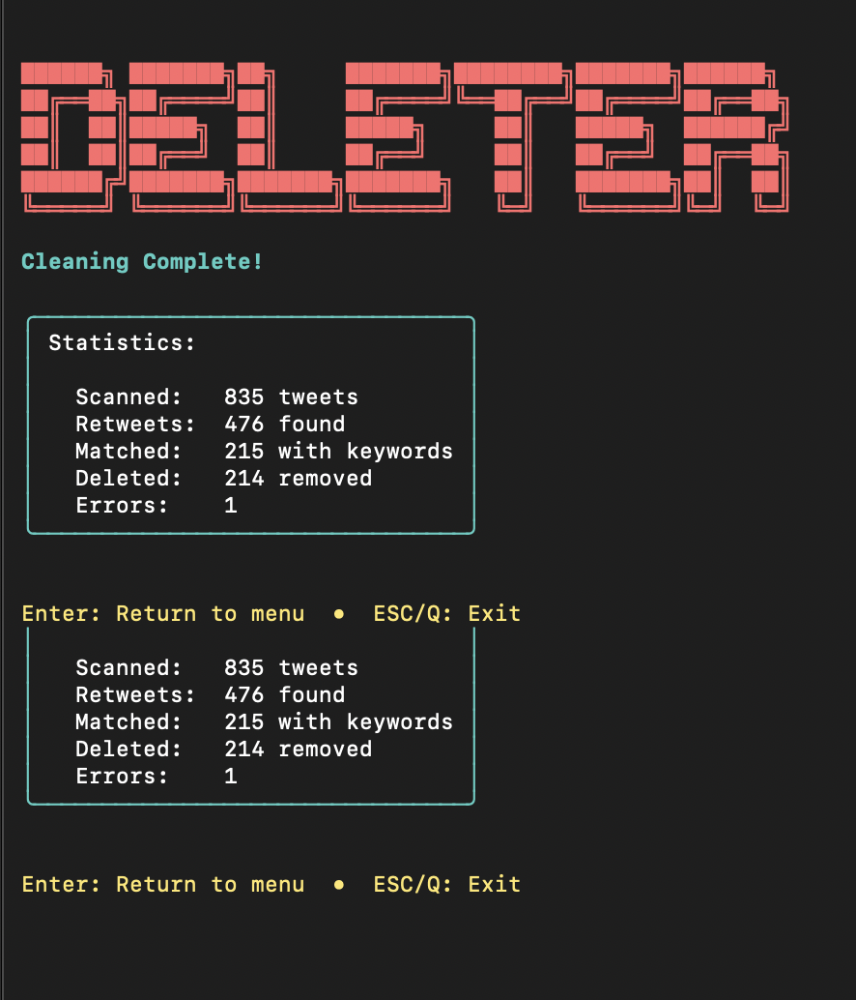
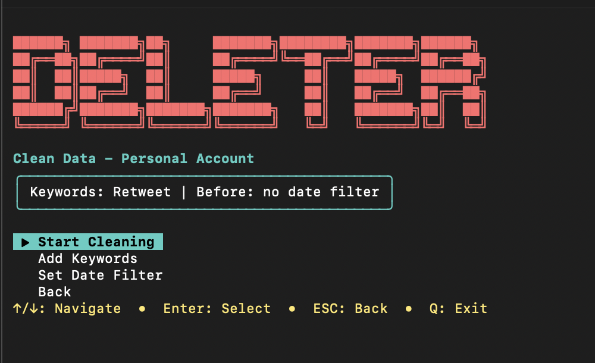

# Twitter Feed Cleaner

TUI app to auto-delete retweets by keywords.



## Quick Start

```bash
go build -o deleter .
./deleter
```

**First run:** Setup wizard starts automatically.

## Setup (3 Steps)

### 1. Extract Data from Browser

Open `x.com`, login, press **F12** → **Console**, paste `extract.js` contents in Console, press Enter.

Copy the output line: `user_id|ct0|guest_id|query_id|query_id`

### 2. Get auth_token (Manual)

In DevTools:
1. **Application** tab → **Cookies** → `https://x.com`
2. Find **`auth_token`** row
3. Double-click Value, copy it

> `auth_token` is HttpOnly — browsers hide it from JavaScript. Must copy manually.

### 3. Run Bot

```bash
./deleter
```

Paste extracted data → paste auth_token → done. Session valid 14 days.

**Keys:** ENTER = next, ESC = back

## Usage

```bash
./deleter                    # Start bot
rm .session.json && ./deleter  # Reset session
```

## How It Works

Uses Twitter GraphQL API: fetches timeline → finds retweets matching keywords → deletes them.

<<<<<<< HEAD
## Result



## License

MIT. Use at your own risk.
=======
>>>>>>> 669f2d2c7d95d5f3832210fc3352b8fd85365c41
